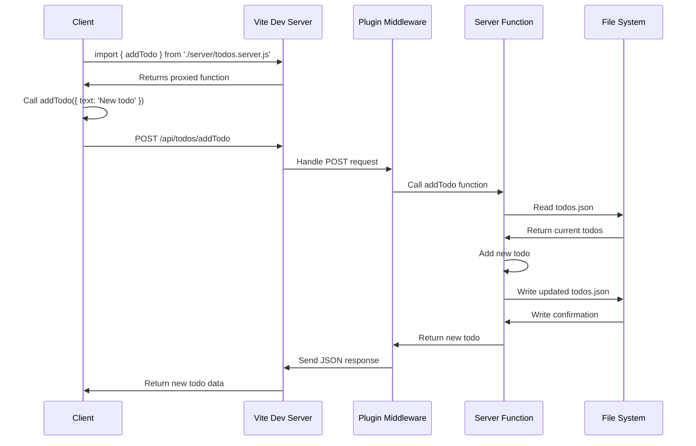

# 🚀 Vite Server Actions

[](https://www.npmjs.com/package/vite-plugin-server-actions)
[](https://www.npmjs.com/package/vite-plugin-server-actions)
[](https://github.com/HelgeSverre/vite-plugin-server-actions/actions)
[](https://opensource.org/licenses/MIT)

> 🚧 **Experimental:** This is a proof of concept and should not be used in production.

**Vite Server Actions** is a Vite plugin that makes it easy to create functions (actions) that runs on the server, while
allowing you to call them from the client-side as if they were local functions.

## ✨ Features

- 🔄 Automatic API endpoint creation for server functions (e.g. `POST /api/todos/addTodo`)
- 🔗 Seamless client-side proxies for easy usage (e.g. `import {addTodo} from './server/todos.server.js'`)
- 🛠 Support for both development and production environments ( `vite build` )
- 🚀 Zero-config setup for instant productivity

## 🚀 Quick Start

1. Install the plugin:

```bash
# Install using npm
npm install vite-plugin-server-actions

# Install using yarn
yarn add vite-plugin-server-actions
```

2. Add to your `vite.config.js`:

```javascript
import {defineConfig} from "vite";
import serverActions from "helgesverre/vite-plugin-server-actions";

export default defineConfig({
	plugins: [
		serverActions(),
	],
});
```

3. Create a `[whatever].server.js` file anywhere in your project:

```javascript
// ex: src/actions/todo.server.js
import fs from "fs";
import path from "path";

const TODO_FILE_PATH = path.join(process.cwd(), "list-of-todos.json");

export async function deleteTodoById(id) {
	const data = fs.readFileSync(TODO_FILE_PATH, "utf-8");
	const todos = JSON.parse(data);
	const newTodos = todos.filter((todo) => todo.id !== id);
	fs.writeFileSync(TODO_FILE_PATH, JSON.stringify(newTodos, null, 2));
}

export async function saveTodoToJsonFile(todo) {
	const data = fs.readFileSync(TODO_FILE_PATH, "utf-8");
	const todos = JSON.parse(data);
	todos.push(todo);
	fs.writeFileSync(TODO_FILE_PATH, JSON.stringify(todos, null, 2));
}

export async function listTodos() {
	const data = fs.readFileSync(TODO_FILE_PATH, "utf-8");
	return JSON.parse(data);
}
```

4. Import and use your server actions in your client-side code:

```html
<!-- ex: src/App.svelte -->
<script>
	import {listTodos, saveTodoToJsonFile, deleteTodoById} from './actions/todo.server.js';

	let todos = [];
	let newTodoText = '';

	async function fetchTodos() {
		todos = await listTodos();
	}

	async function addTodo() {
		await saveTodoToJsonFile({id: Math.random(), text: newTodoText});
		newTodoText = '';
		await fetchTodos();
	}

	async function removeTodo(id) {
		await deleteTodoById(id);
		await fetchTodos();
	}

	fetchTodos();
</script>

<div>
	<h1>Todos</h1>
	<ul>
		{#each todos as todo}
			<li>
				{todo.text}
				<button on:click={() => removeTodo(todo.id)}>Remove</button>
			</li>
		{/each}
	</ul>
	<input type="text" bind:value={newTodoText} />
	<button on:click={addTodo}>Add Todo</button>
</div>
```

## 🤯 How it works

Vite Server Actions works by creating an API endpoint for each server function you define.

When you import a server action in your client-side code, Vite Server Actions will intercept the import and return a
proxy function that sends a request to the server endpoint instead of executing the function locally.

In development mode, the server is run as a middleware in the Vite dev server, while in production mode, the server is
bundled into a single file that can be run with Node.js.

### Sequence Diagram



## 🔧 Configuration

Vite Server Actions works out of the box, but you can customize it:

```javascript
serverActions({
	// Options (coming soon)
});
```

## 🛠️ Configuration Options

TODO: Add configuration options and descriptions

| Option           | Type                                   | Default     | Description                      |
|------------------|----------------------------------------|-------------|----------------------------------|
| logLevel         | 'error' \| 'warn' \| 'info' \| 'debug' | 'info'      | Server log level                 |
| serverPath       | string                                 | '/api'      | Base path for server endpoints   |
| serverPort       | number                                 | 3000        | Port for the server              |
| serverHost       | string                                 | 'localhost' | Host for the server              |
| serverMiddleware | (app: Express) => void                 | -           | Custom middleware for the server |

## 🤝 Contributing

Contributions, issues, and feature requests are welcome! Feel free to
check [issues page](https://github.com/helgesverre/vite-plugin-server-actions/issues).

## 📝 License

This project is [MIT](https://opensource.org/licenses/MIT) licensed.


