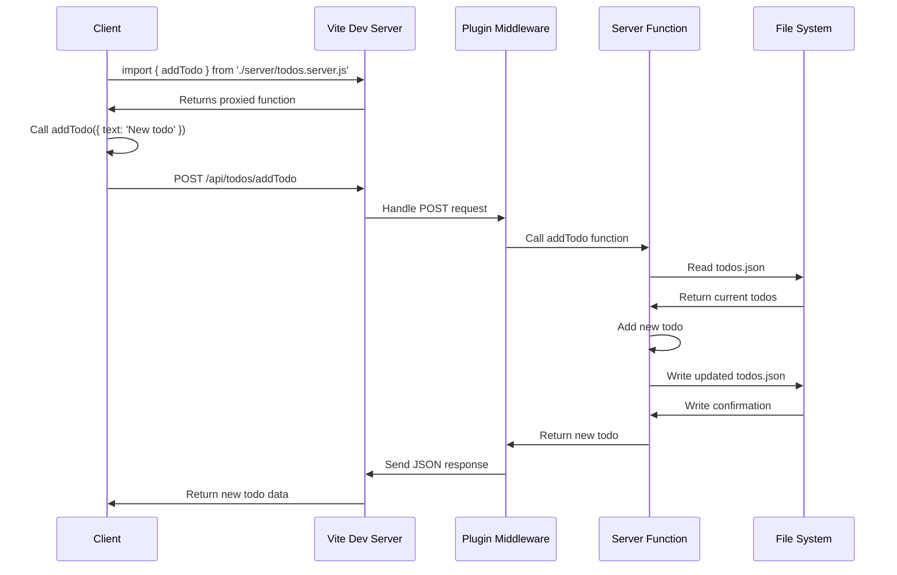

# 🚀 Vite Server Actions

[](https://www.npmjs.com/package/vite-plugin-server-actions)
[](https://www.npmjs.com/package/vite-plugin-server-actions)
[](https://github.com/HelgeSverre/vite-plugin-server-actions/actions)
[](https://opensource.org/licenses/MIT)

Seamlessly integrate server-side functions into your Vite projects with automatic API endpoints and client-side proxies.

## ✨ Features

- 🔄 Automatic API endpoint creation for server functions
- 🔗 Seamless client-side proxies for easy usage
- 🛠 Support for both development and production environments
- 🚀 Zero-config setup for instant productivity

## 🚀 Quick Start

1. Install the plugin:

```bash
npm install vite-plugin-server-actions
```

2. Add to your `vite.config.js`:

```javascript
import { defineConfig } from "vite";
import serverActions from "helgesverre/vite-plugin-server-actions";

export default defineConfig({
	plugins: [serverActions()],
});
```

3. Create a `.server.js` file with your server functions:

```javascript
// api.server.js
export async function getData() {
	return { message: "Hello from the server! 👋" };
}
```

4. Use in your client code:

```javascript
import { getData } from "./api.server.js";

getData().then((data) => console.log(data));
```

## 🛠 Usage

### Server-side (.server.js)

Create functions in `.server.js` files:

```javascript
// users.server.js
export async function getUsers() {
	// Fetch users from database
	return [
		{ id: 1, name: "Alice" },
		{ id: 2, name: "Bob" },
	];
}

export async function createUser(userData) {
	// Create a new user
	return { id: 3, ...userData };
}
```

### Client-side

Import and use as if they were local functions:

```javascript
import { getUsers, createUser } from "./users.server.js";

// Get users
const users = await getUsers();

// Create a new user
const newUser = await createUser({ name: "Charlie" });
```

## 🔧 Configuration

Vite Server Actions works out of the box, but you can customize it:

```javascript
serverActions({
	// Options (coming soon)
});
```

## Configuration options:

| Option             | Type                                   | Default          | Description                                |
| ------------------ | -------------------------------------- | ---------------- | ------------------------------------------ |
| serverFunctionsDir | string                                 | 'src/server'     | Directory containing server function files |
| serverOutputFile   | string                                 | 'dist/server.js' | Output file for generated server           |
| cors               | boolean                                | false            | Enable CORS for all routes                 |
| bodyLimit          | string                                 | '1mb'            | Request body size limit                    |
| logLevel           | 'error' \| 'warn' \| 'info' \| 'debug' | 'info'           | Server log level                           |

## How it works



## 🤝 Contributing

Contributions, issues, and feature requests are welcome! Feel free to
check [issues page](https://github.com/helgesverre/vite-server-actions/issues).

## 📝 License

This project is [MIT](https://opensource.org/licenses/MIT) licensed.

---

Made with ❤️ by [Your Name]
